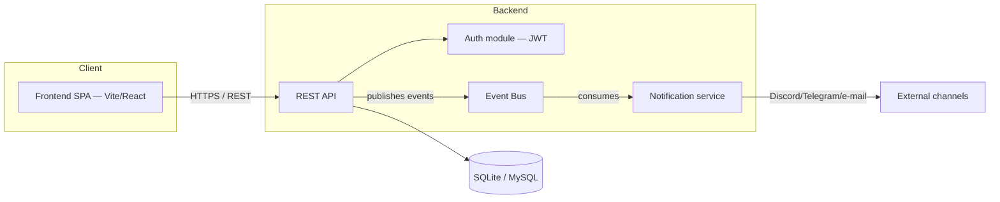

# Slides — Final Project Defense, Part 1: Sprint 3 & Final Review

Part 1 of 2 (~15 min). Part 2 (deep dive + live demo + closing) is a separate deck:
`FINAL_PART2_SLIDES.md` / `FINAL_PART2_ORAL.md`.
Minimal text on screen — the script (`FINAL_PART1_ORAL.md`, in French) carries the spoken content.
Each slide is tagged with the speaker and rough duration.

> Update before the defense day: slide 8 (final perimeter — missing) depends on the exact state of
> issues `#69`, `#96`, `#97`, `#99`, `#102`, `#105` at that time.

---

## Slide 1 — Title

**Legacy TodoList Rework — Final Defense**
Part 1: Sprint 3 & Final Review
Reworking `docker/getting-started-app` into an authenticated Kanban application

Team (6): Cédric · Etienne · Naem · Rayan · Florian · Evan
*Defense — [date]*

> Speaker 1 · ~20s

---

## Slide 2 — Project context

- Starting point: a legacy Node.js/Express TodoList (`docker/getting-started-app`) with a plain
  `items` table, no auth, no build, no tests
- Mission: rework it into a Kanban app with authentication, GDPR compliance, real-time monitoring —
  **correct the legacy, don't rewrite it from scratch**
- 3 sprints, ~4 weeks (01/09 → 30/09)

> Speaker 1 · ~1 min 30

---

## Slide 3 — Final team organisation

- 3 fixed pairs across the whole project: Agile & Backlog · Audit & Architecture/Persistence ·
  Tooling & CI/CD
- Fixed Product Owner across all 3 sprints; Scrum Master rotates every sprint
- Ceremonies unchanged since Sprint 1: daily stand-up, sprint planning, sprint review, retrospective
  — all traced in writing (issue/PR comment), never only verbal
- Discipline example: two competing frontend PRs for the same issue → resolved as a team decision
  (frontend lead), not a silent merge of both

> Speaker 2 · ~2 min

---

## Slide 4 — Technical decisions (ADR)

| ADR | Decision |
|---|---|
| 0001 | Sync (REST) / async (events) — hybrid, in-process event bus |
| 0002 | Persistence: fix SQLite/MySQL in place, no rewrite |
| 0003 | Language: JavaScript + JSDoc + `checkJs`, not TypeScript |
| 0004 | Application architecture: incremental extraction of a service layer |
| 0005 | Vite / JWT / validation — *in review, not yet merged* |

5 ADRs total, Nygard format (Context → Alternatives → Decision → Consequences) — every structuring
choice traced, not just decided in a standup.

> Speaker 3 · ~2 min

---

## Slide 5 — Final architecture

Observability layer added in Sprint 2, deliberately separate from this diagram: Prometheus scrapes
`/metrics`, Grafana visualizes — optional, doesn't change how the app itself works.

> Speaker 3 · ~1 min

---

## Slide 6 — Final data model

`User → Project → Column → Task`, ownership enforced at the service layer (not duplicated per
route). Cascade delete on account removal (GDPR right to erasure); `assignee_id` set to `null`
instead of deleting a task when only the assignee (not the owner) is removed.

> Speaker 3 · ~40s

---

## Slide 7 — Final product perimeter: shipped

- **Auth**: JWT register/login, bcrypt hashing, account deletion with cascade
- **GDPR**: explicit consent checkbox at registration, right to erasure, right to data export/portability
- **Kanban**: projects/columns/tasks CRUD, drag & drop between columns, priority + due date on cards
- **Monitoring**: multi-channel alerts (Discord/Telegram/e-mail) on business events and health
  transitions — verified with real webhooks/bot, not mocks
- **Observability**: Prometheus + Grafana dashboard, pre-provisioned, verified with real data
- **Security hardening**: generic error handler (no stack traces leaked to clients), JWT
  revocation check against account existence

> Speaker 1 · ~2 min

---

## Slide 8 — Final product perimeter: known gaps

Said out loud, not hidden:

- Docker image doesn't build/serve the frontend yet (`#102`, in progress) — a fresh
  `docker compose up` doesn't show the app on `/`
- Event-driven flow stays limited to `TaskCreated` → notification; no persisted business
  consequence beyond that (`#69`)
- No full RGAA audit (106 criteria on a representative sample) — a partial audit found and fixed
  a contrast issue, but drag & drop still has **no keyboard alternative** (mouse/touch only) —
  detail in Part 2
- Docker image not published to a registry; in-app (non-external) notifications not built
- ADR 0005 still in review

> Speaker 1 · ~1 min 30 · *honesty here matters more than a clean slide*

---

## Slide 9 — General project stats

- **118** commits · **43** merged PRs (2 closed without merging) · **57** GitHub issues (48 closed)
- **5** ADRs (4 merged, 1 in review)
- **362** backend tests / **19** frontend tests passing on `main` (higher on PRs in review)
- **~3,900** lines of backend code, **~1,500** lines of frontend code
- 2 critical bugs found and fixed by testing the real stack, not just unit tests: missing DB
  migrations in the Docker image, JWT still valid after account deletion

> Speaker 2 · ~1 min 30

---

## Slide 10 — Team contributions

| Member | Merged PRs | Main area |
|---|---|---|
| Rayan | 10 | CRUD API, MySQL persistence |
| Naem | 9 | Schema migration, persistence |
| Cédric | 7 | Frontend (Vite, Kanban, drag & drop, GDPR export) |
| Evan | 7 | Monitoring, Grafana/Prometheus, CI/CD |
| Etienne | 6 | Auth, Docker fixes, security hardening |
| Florian | 4 | Docker/CI foundations, Sprint 3 stabilization |

> Speaker 2 · ~1 min · *each number is a real merged PR, not an estimate*

---

## Slide 11 — Personal insights

Three short, first-person takeaways — one per speaker, from this sprint and the project as a whole.

> Speaker 1, 2, 3 · ~20s each · *content in script, genuinely personal, not scripted generically*

---

**End of Part 1.** Continue with `FINAL_PART2_SLIDES.md` (deep dive, live demo, closing).
