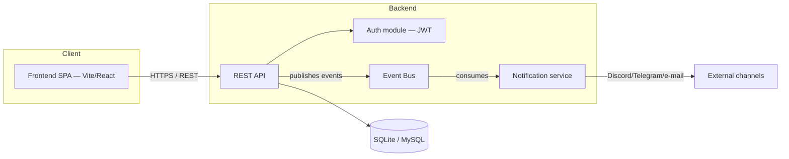

# Slides — Final Project Defense

45 min total: 15 min Sprint 3 & Final Review, 25 min deep dive, 5 min coach feedback.
Minimal text on screen — the script (`FINAL_ORAL.md`, in French) carries the spoken content.
Each slide is tagged with the speaker and rough duration.

> Update before the defense day: slide 8 (final perimeter — missing) and slide 20 (live demo
> feature choice) depend on the exact state of issues #69, #96, #97, #99, #102, #105 at that time.

---

## Slide 1 — Title

**Legacy TodoList Rework — Final Defense**
Reworking `docker/getting-started-app` into an authenticated Kanban application

Team (6): Cédric · Etienne · Naem · Rayan · Florian · Evan
*Defense — [date]*

> Speaker 1 · ~20s

---

## PART 1 — Sprint 3 & Final Review (15 min)

---

## Slide 2 — Project context

- Starting point: a legacy Node.js/Express TodoList (`docker/getting-started-app`) with a plain
  `items` table, no auth, no build, no tests
- Mission: rework it into a Kanban app with authentication, GDPR compliance, real-time monitoring —
  **correct the legacy, don't rewrite it from scratch**
- 3 sprints, ~4 weeks (01/09 → 30/09)

> Speaker 1 · ~1 min 30

---

## Slide 3 — Final team organisation

- 3 fixed pairs across the whole project: Agile & Backlog · Audit & Architecture/Persistence ·
  Tooling & CI/CD
- Fixed Product Owner across all 3 sprints; Scrum Master rotates every sprint
- Ceremonies unchanged since Sprint 1: daily stand-up, sprint planning, sprint review, retrospective
  — all traced in writing (issue/PR comment), never only verbal
- Discipline example: two competing frontend PRs for the same issue → resolved as a team decision
  (frontend lead), not a silent merge of both

> Speaker 2 · ~2 min

---

## Slide 4 — Technical decisions (ADR)

| ADR | Decision |
|---|---|
| 0001 | Sync (REST) / async (events) — hybrid, in-process event bus |
| 0002 | Persistence: fix SQLite/MySQL in place, no rewrite |
| 0003 | Language: JavaScript + JSDoc + `checkJs`, not TypeScript |
| 0004 | Application architecture: incremental extraction of a service layer |
| 0005 | Vite / JWT / validation — *in review, not yet merged* |

5 ADRs total, Nygard format (Context → Alternatives → Decision → Consequences) — every structuring
choice traced, not just decided in a standup.

> Speaker 3 · ~2 min

---

## Slide 5 — Final architecture

Observability layer added in Sprint 2, deliberately separate from this diagram: Prometheus scrapes
`/metrics`, Grafana visualizes — optional, doesn't change how the app itself works.

> Speaker 3 · ~1 min

---

## Slide 6 — Final data model

`User → Project → Column → Task`, ownership enforced at the service layer (not duplicated per
route). Cascade delete on account removal (GDPR right to erasure); `assignee_id` set to `null`
instead of deleting a task when only the assignee (not the owner) is removed.

> Speaker 3 · ~40s

---

## Slide 7 — Final product perimeter: shipped

- **Auth**: JWT register/login, bcrypt hashing, account deletion with cascade
- **GDPR**: explicit consent checkbox at registration, right to erasure, right to data export/portability
- **Kanban**: projects/columns/tasks CRUD, drag & drop between columns, priority + due date on cards
- **Monitoring**: multi-channel alerts (Discord/Telegram/e-mail) on business events and health
  transitions — verified with real webhooks/bot, not mocks
- **Observability**: Prometheus + Grafana dashboard, pre-provisioned, verified with real data
- **Security hardening**: generic error handler (no stack traces leaked to clients), JWT
  revocation check against account existence

> Speaker 1 · ~2 min

---

## Slide 8 — Final product perimeter: known gaps

Said out loud, not hidden:

- Docker image doesn't build/serve the frontend yet (`#102`, in progress) — a fresh
  `docker compose up` doesn't show the app on `/`
- Event-driven flow stays limited to `TaskCreated` → notification; no persisted business
  consequence beyond that (`#69`)
- No full RGAA audit (106 criteria on a representative sample) — a partial audit found and fixed
  a contrast issue, but drag & drop still has **no keyboard alternative** (mouse/touch only)
- Docker image not published to a registry; in-app (non-external) notifications not built
- ADR 0005 still in review

> Speaker 1 · ~1 min 30 · *honesty here matters more than a clean slide*

---

## Slide 9 — General project stats

- **118** commits · **43** merged PRs (2 closed without merging) · **57** GitHub issues (48 closed)
- **5** ADRs (4 merged, 1 in review)
- **362** backend tests / **19** frontend tests passing on `main` (higher on PRs in review)
- **~3,900** lines of backend code, **~1,500** lines of frontend code
- 2 critical bugs found and fixed by testing the real stack, not just unit tests: missing DB
  migrations in the Docker image, JWT still valid after account deletion

> Speaker 2 · ~1 min 30

---

## Slide 10 — Team contributions

| Member | Merged PRs | Main area |
|---|---|---|
| Rayan | 10 | CRUD API, MySQL persistence |
| Naem | 9 | Schema migration, persistence |
| Cédric | 7 | Frontend (Vite, Kanban, drag & drop, GDPR export) |
| Evan | 7 | Monitoring, Grafana/Prometheus, CI/CD |
| Etienne | 6 | Auth, Docker fixes, security hardening |
| Florian | 4 | Docker/CI foundations, Sprint 3 stabilization |

> Speaker 2 · ~1 min · *each number is a real merged PR, not an estimate*

---

## Slide 11 — Personal insights

Three short, first-person takeaways — one per speaker, from this sprint and the project as a whole.

> Speaker 1, 2, 3 · ~20s each · *content in script, genuinely personal, not scripted generically*

---

## PART 2 — Deep dive (25 min)

---

## Slide 12 — Git repository

- Conventional Commits enforced by a pre-commit hook (`husky` + `commitlint`)
- One branch per issue, named after it; stacked branches when a PR genuinely depends on another
  unmerged one (documented in the PR body, not left implicit)
- Contract-first pattern visible in the history itself: a pure JSDoc interface commit precedes its
  implementation on every major feature (user persistence, Kanban persistence, notification
  channels)

> Speaker 2 · ~3 min · *show `git log --oneline --graph` live*

---

## Slide 13 — Code review

- Definition of Done, enforced without exception: **1 approval minimum**, linked issue
  (`closes #X`), tests for new business logic, green quality gate, demonstrable in review
- Reviews are real, not rubber-stamped: reviewers verify independently — re-running tests,
  checking the diff, sometimes testing manually against a live server — rather than trusting a
  green CI alone

> Speaker 2 · ~3 min

---

## Slide 14 — CI/CD process

- Pipeline: lint → format check → unit tests → **full Docker Compose stack** (`app`, `db`,
  `prometheus`, `grafana`) built and health-checked, not just unit tests in isolation
- Feedback loop: a broken Docker build fails CI before it fails a live demo
- Gap disclosed: CI validates the API responds, but not yet that the frontend is actually served
  (`#102`) — CI is honest about what it does and doesn't cover

> Speaker 3 · ~3 min

---

## Slide 15 — QA strategy

- 381 automated tests (backend + frontend) — but the two most serious bugs of the project were
  found by **testing the real stack**, not by unit tests:
  1. Docker image shipped with an empty database schema (migrations never copied)
  2. A deleted user's JWT stayed valid and could crash the server, leaking a SQL stack trace
- Lesson taken into practice: verify manually against real infrastructure (real Docker, real
  webhooks) before trusting "all tests green"

> Speaker 3 · ~3 min

---

## Slide 16 — Work process

- Same rhythm since Sprint 1: daily stand-up, sprint planning, sprint review, retrospective —
  traced in the GitHub Project board (Backlog → Ready → In progress → In review → Done)
- MoSCoW prioritization kept explicit and current on the board across all 3 sprints
- Async coordination between reviews: relevant context handed off in PR/issue comments, so no
  decision only exists as a verbal memory

> Speaker 2 · ~2 min

---

## Slide 17 — Disability management: RGAA

**What RGAA is** (new requirement from the 2nd intermediate jury, added this Sprint 3): the French
legal accessibility standard — 106 criteria across 13 themes (images, colors, forms, navigation,
scripts…), the French translation of WCAG 2.1 AA's POUR principles (Perceivable/Operable/
Understandable/Robust). Legal basis: Law of 11/02/2005 (art. 47). Historically mandatory for
public-sector sites; since the European Accessibility Act (28/06/2025), also for private companies
over 10 employees or €2M revenue. Official audit tool (Ara, by DINUM) is **not automated** — it
requires expert human judgment on a representative page sample.

**What we actually did today, not a claim of full compliance:**
- Automated scan (Lighthouse/axe) on login/register: **100% accessibility score**
- Manual review of the Kanban board (the automated tool can't replace this — same reason Ara isn't
  automated): priority already used text + color together, never color alone
- **Found and fixed**: 2 of 3 priority badges failed WCAG AA color contrast (3.19:1 and 3.09:1 vs.
  the 4.5:1 required) — darkened, same color family, same meaning, no behavior change
- **Found, not fixed, disclosed**: drag & drop has no keyboard alternative — a real RGAA gap,
  would need a non-trivial interaction redesign, not a same-day fix

> Speaker 3 · ~2 min 30 · *own this gap, don't oversell it — see issue #107*

---

## Slide 18 — Live demo: full feature, full process

About to show one feature end-to-end, respecting the whole team process:

**Issue → branch → commits (contract first) → PR → review (Definition of Done) → merge → demo**

Feature chosen: *[pick the cleanest, most complete example available at defense time — e.g. the
Kanban CRUD (#66/#78) or the GDPR account deletion (#65/#94)]*

> Speaker 1 · ~1 min intro, then live · total ~8 min

---

## Slide 19 — Live demo: the app itself

Register → log in → create a project → create a task → drag it to another column → set a priority
and due date → reload to prove persistence → check the Grafana dashboard move in near real time →
check the Discord/Telegram notification arrive.

> Speaker 1 · continued from slide 18

---

## PART 3 — Closing

---

## Slide 20 — What's left, honestly

Must-have gaps, both in progress: `#102` (Docker not serving the frontend), `#69` (event-driven
flow extension). Should-have items (`#73`, `#74`, `#96`, `#103`) — status as of defense day,
updated live if needed.

> Speaker 1 · ~40s

---

## Slide 21 — Questions

**Thank you.**

Ready to show: full Git history · any merged PR from issue to merge · the running app, Docker
stack, Grafana dashboard, live notification

> Speaker 1 · transition to Q&A / coach feedback

---

## Annex (not projected by default)

- **A1**: `git log --oneline --graph` on 2-3 major PRs, contract-before-implementation visible
- **A2**: pre-chosen complete-feature PR for the live demo
- **A3**: Grafana dashboard full screen, real data
- **A4**: full ADR texts (0001–0005) if the jury wants to read one in detail
